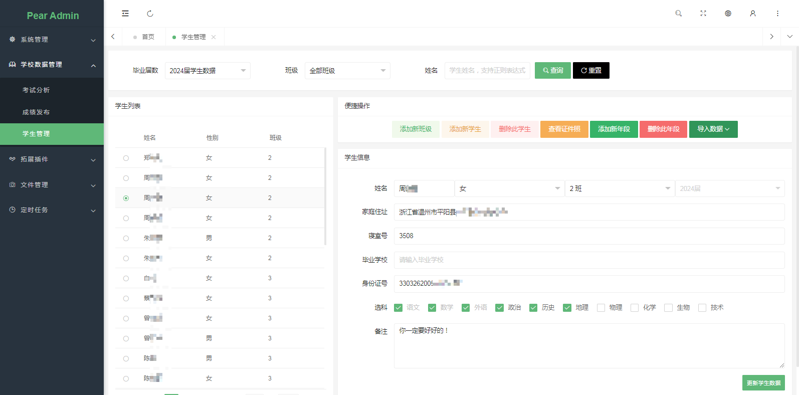
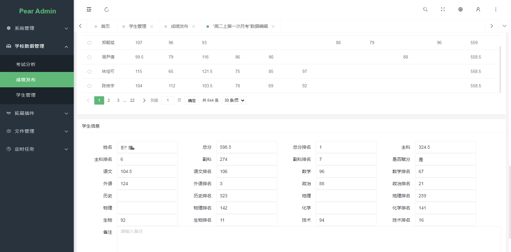
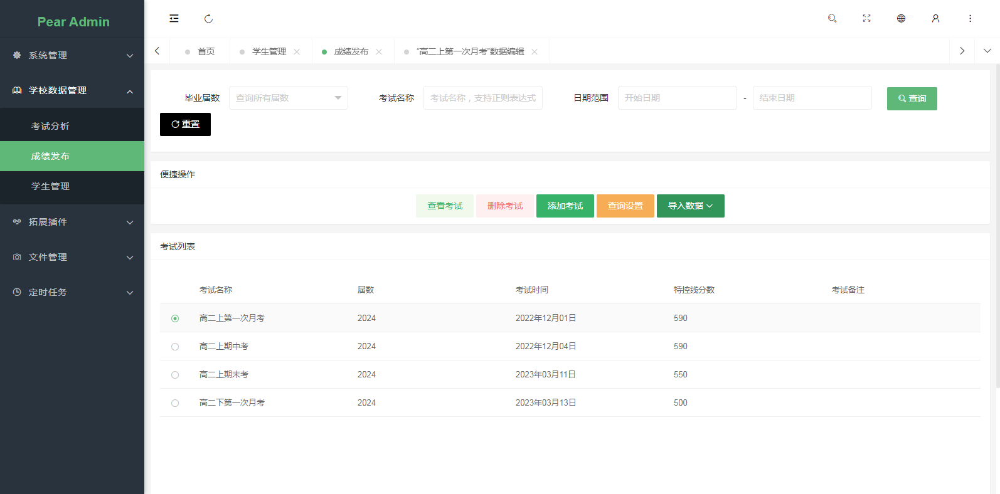
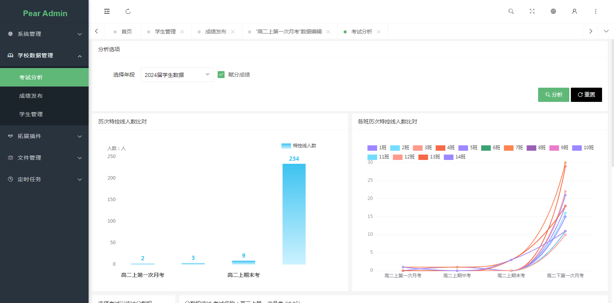
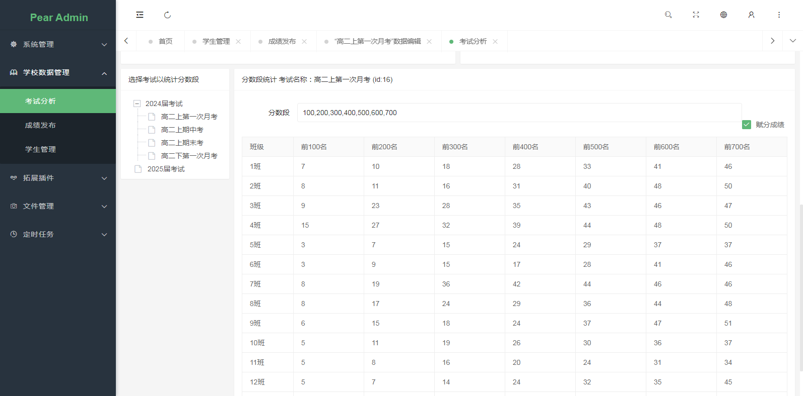
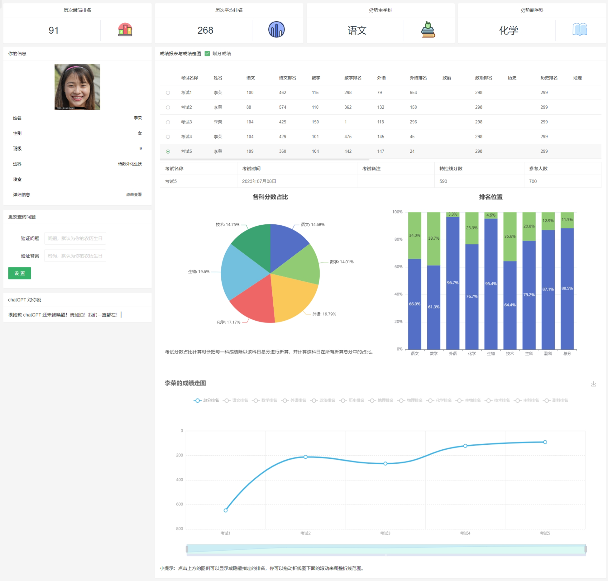
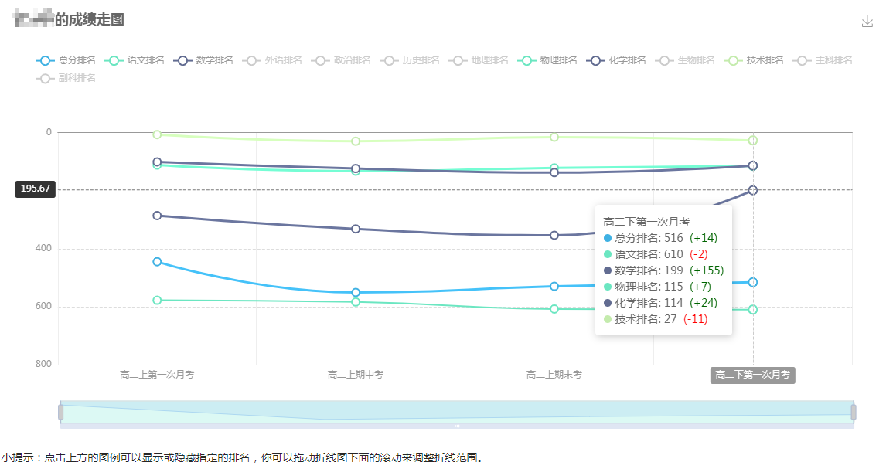
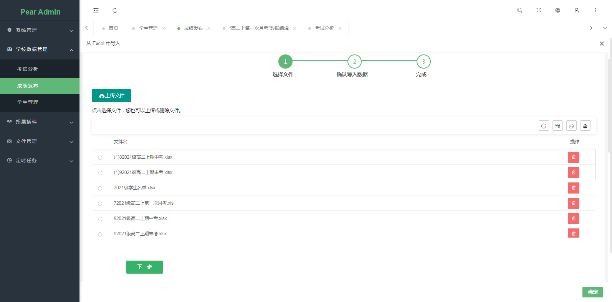

<!--|
这里的内容博客才有
|-->

<!---->这里面的内容只有码云看得见 <!---->

<div align="center">
<br/>
<br/>
  <h1 align="center">
    Python Schoolmanager Pear
  </h1>
  <h4 align="center">
    一 个 灵 活 的 学 校 数 据 管 理 项 目
  </h4> 
</div>

<div align="center">
  
</div>


> **由于主项目Pear Admin Flask 的修改，配置部分可能有所变化，现在已经更新。**

## 项目介绍与设计理念

这是一个基于 Python Flask 的学校数据管理插件，后台界面采用开源项目 Pear Admin Flask，并且以插件的形式接入 Pear Admin Flask 。

随着信息化的推进，学校数据管理的需求越来越高，如何有效地收集、分析和利用学校数据，提高教育质量和效率，是一个亟待解决的问题。为此，我开发了一个基于 Python Flask 的学校数据管理插件，旨在为学校提供一个简单、灵活、安全的数据管理平台。

我们学校经常和其他学校一起举办考试，考完后，如何对联合体的成绩进行分析和评价是一个重要的问题。对于老师，处理成绩，一直是一个头疼的问题，它通常耗时间耗经历。对于同学，如何查看历次考试的成绩、如何分析考试成绩，也是一个问题。为此我开始筹划“学校数据管理系统”的编写。

此项目使用 SQLite3 作为数据库存储数据，并采用 Jinja2 作为模板引擎渲染页面。此外，此项目还支持用户验证和权限控制，保证了数据的安全性。

我的设计理念是：简单而不简陋，灵活而不混乱。我希望通过我的插件，能够帮助学校实现高效、便捷、智能的数据管理 。

项目演示视频：[Python Schoolmanager 学校数据管理-哔哩哔哩](https://b23.tv/kERTlNb)

## 项目说明 

项目基于我参与开发的 [Pear Admin Flask](https://gitee.com/pear-admin/pear-admin-flask)，但是并**不修改原项目**，而是以插件的形式接入。当今时代，开源共建为热门话题，越来越多的企业和个人参与到开源项目中，分享自己的代码和经验，共同推动技术创新和社会进步。开源共建不仅能够提高软件质量和安全性，还能够激发创造力和协作精神，形成良好的生态环境，而此项目以插件的形式接入有利于项目的二次开发。

所以在搭建项目前，可以参考 [Pear Admin Flask 配置搭建](https://pear-admin.gitee.io/pear-admin-site/doc/index.html) 的相关内容 。

**采用 Python 版本：** ```3.8.6```  _在开发项目时，推荐使用 >= 3.8.6 的 Python 运行此项目_ 

**采用 IDE：** ```Visual Studio Code```  _推荐使用 Visual Studio Code、PyCharm 等 IDE 开发_ 

## 快速预览

|  |  |
|---------------------|---------------------|
||  |
||  |
||  |
|| |


## 设计计划


- [X] 后台学生信息管理
- [X] 后台成绩发布功能
- [X] 后台成绩基本分析功能
- [X] Excel 导入功能
- [X] 前台学生成绩基本查询与成绩分析
- [ ] 学分管理功能
- [ ] 前台学生各次考试分析
- [ ] 时光邮局（学生给未来的自己寄信）
- [ ] 学生 PK 功能（学生与学生对比）
- [ ] 历次考试对比功能（考试与考试对比）
- [ ] Excel 导出功能
- [ ] 多学校管理功能

## 更新记录

- 2023.3.21 更新功能：管理员可以直接查询学生历次成绩
- 2023.3.24 修复BUG：数据库文件不会自动创建
- 2023.3.24 修复BUG：考试发布页面无时间选择搜索报错
- 2023.3.24 修复BUG：用户发送非法 limit 与 page 参数时报错
- 2023.3.24 修复BUG：前台查询页面图标自动重设大小
- 2023.3.24 更新功能：创建新班级时可以自定义占位学生名
- 2023.3.25 更新功能：重写权限判断
- 2023.3.25 更新功能：加入“chatGPT对你说”功能，使用 AI 分析成绩并给出建议。
- 2023.4.24 修复BUG：修正 layui 获取单选项目奇特BUG。
- 2023.4.24 修复BUG：修正文件名包含空格的问题。
- 2023.4.27 修复BUG：chatGPT渲染阻塞个人照片BUG。
- 2023.5.2 修复BUG：赋分成绩渲染表格错误
- 2023.7.5 更新功能：更新项目与主项目同一
- 2023.7.7 更新功能：允许筛选导入
- 2023.7.8 更新功能：学生数据图表分析

## 安装教程

### 安装 Python

安装 Python 过程不过多赘述，请到 [Python 官网](https://www.python.org/) 下载。如果您不想要复杂的安装步骤，我们推荐使用**虞颖健**老师打包的 [Python 懒人版](https://gitee.com/yu-yingjian/day_day_up?_from=gitee_search)。点击查看 --> [视频安装教程](https://www.bilibili.com/video/BV1Vd4y197se/?spm_id_from=333.999.0.0)

### 搭建 Pear Admin Flask

Pear Admin Flask 的搭建步骤详细可以参考其官方文档，这里进行摘录（注意：此插件是基于 **Pear Admin Flask master** 分支的）：

#### 环境要求
- Python >= 3.6
- MySQL >= 5.7.0 (非必要，可以使用 SQLite3 作为数据库)

_在 Windows 下，对于 MySQL 的搭建，可以使用 [PHPStudy](https://www.xp.cn/) 小皮面板一键搭建 MySQL 环境。为了方便导入 Pear Admin Flask 的原始数据库数据，可以使用 [HeidiSQL](https://www.heidisql.com/download.php) 软件进行操作。_

#### 克隆远程仓库

您可以使用 git 来克隆远程仓库：

```shell
# 进入项目主目录
cd Pear Admin Flask

# 使用 git 克隆远程仓库
git clone https://gitee.com/pear-admin/pear-admin-flask.git

# 切换分支
git checkout master  # master, main or mini
```

或者直接前往 Pear Admin Flask 项目的[Gitee 主页](https://gitee.com/pear-admin/pear-admin-flask)下载项目仓库。

#### 搭建开发环境

**我们推荐使用 Python 的虚拟环境来开发该项目，这样便于项目的迁移与二次开发。当然，您也可以选择使用原 Python 环境。**

如果你想创建 Python 虚拟环境，你可以使用下面的命令行：

```shell
# 在当前目录的venv文件夹创建虚拟环境
python -m venv venv

# 激活虚拟环境
venv\Scripts\activate
```

**如果在创建虚拟环境时报错 “ModuleNotFoundError” ，这说明您的 Python 版本小于 3.3 。**

#### 安装项目依赖

```shell
# 使用 pip 安装必要模块（对于 master 分支）
pip install -r requirement\dev.txt

# 安装 此项目依赖
pip install pandas
pip install requests
pip install openpyxl
```

或者您可以尝试：

```shell
# 使用 pip 安装必要模块（对于 master 分支）
python -m pip install -r requirement\requirement.txt

# 安装 此项目依赖
python -m pip install pandas
python -m pip install requests
pip install openpyxl
```

### 导入 Pear Admin Flask 初始化数据库

#### 配置数据库

+ 使用 SQLite3 作为数据库（不需要搭建 SQL 环境）

打开文件 `applications/config.py` 并修改如下行：

```python
# mysql 数据库的配置信息
SQLALCHEMY_DATABASE_URI = f"mysql+pymysql://{MYSQL_USERNAME}:{urlquote(MYSQL_PASSWORD)}@{MYSQL_HOST}:{MYSQL_PORT}/{MYSQL_DATABASE}?charset=utf8mb4"

# 改为
SQLALCHEMY_DATABASE_URI = "sqlite:///database.db"

# 如果需要，可以同时更改 APSCHEDULER 的参数（本项目用不到，如果对于 Pear Admin Flask 完整功能则是必须的）
SCHEDULER_JOBSTORES: dict = {
        'default': SQLAlchemyJobStore(
            url=f'mysql+pymysql://{MYSQL_USERNAME}:{MYSQL_PASSWORD}@{MYSQL_HOST}:{MYSQL_PORT}/{MYSQL_DATABASE}')
}

# 改为
SCHEDULER_JOBSTORES: dict = {
        'default': SQLAlchemyJobStore(
            url="sqlite:///database.db")
}
```

+ 使用 mySQL 数据库

请按照配置修改变量：

```python
# mysql 配置
MYSQL_USERNAME = "root"
MYSQL_PASSWORD = "123456"
MYSQL_HOST = "127.0.0.1"
MYSQL_PORT = 3306
MYSQL_DATABASE = "PearAdminFlask"
```

#### 导入数据库

```
# 初始化数据库
flask db init
flask db migrate
flask db upgrade
flask admin init
```

依次执行后会显示：

```
加载系统必须用户数据
加载系统必须角色数据
加载系统必须部门数据
加载系统必须权限数据
基础数据存入
用户角色数据存入
角色权限数据存入
数据初始化完成,请使用python app.py命令运行
```

### 安装学校数据管理插件（Python Schoolmanager Pear）

克隆此仓库的所有文件到 Pear Admin Flask 的 plugins/SchoolManager 文件夹下（需要手动创建 SchoolManager 文件夹）。

```shell
# 进入项目插件目录
cd plugins

# 使用 git 克隆远程仓库
git clone https://gitee.com/wojiaoyishang/python-schoolmanager-pear.git
```

并在 ```applications/config.py``` 文件中做如下修改：

```
# 插件配置
PLUGIN_ENABLE_FOLDERS = []
```

添加（或替换上）```SchoolManager```，如：

```
# 插件配置
PLUGIN_ENABLE_FOLDERS = ["SchoolManager"]
```

**注意：如果文件夹不是“SchoolManager”，则需要修改上述的名称为您创建的文件夹的名称。**


### 运行项目

#### Flask —— 调试模式下运行

如果你想在调试模式下运行此项目请使用下面的命令：

```shell
flask run
```

或者尝试

```shell
python -m flask run
```

当然，你也可以调用项目中的 ```app.py``` 运行此项目，如：

```shell
python app.py
```

_在实际调试过程中，如果遇到了资源文件加载不完全的情况，请多刷新几次网页，具体原因未知，可能是 Flask 版本的问题。_

#### pywsgi —— 发布项目

如果你只是作为此项目的用户，你可以通过如下的方式更加稳定的运行项目。

安装 pywsgi ：

```shell
pip install gevent
```

并修改 app.py 中的内容为：

```python
from applications import create_app
from flask_migrate import Migrate
from applications.extensions import db

from gevent import pywsgi

app = create_app()


migrate = Migrate(app, db)

if __name__ == '__main__':
    # app.run()
    server = pywsgi.WSGIServer(('0.0.0.0', 7000), app, log=None)
    server.serve_forever()
```

上述中的 ```7000``` 为运行端口， ```0.0.0.0``` 为绑定的IP地址。

## 目录架构

```
│  init_examAnalyse.py    # 考试分析视图、API初始化
│  init_examPublish.py    # 考试发布功能视图、API初始化
│  init_student.py    # 学生管理视图、API初始化
│  init_utils.py    # 文件上传功能、导入功能初始化
│  __init__.json    # 插件介绍文件
│  __init__.py    # 插件初始化文件
│
├─data
│  │  examData.db    # 成绩数据库
│  │  studentData.db    # 学生数据数据库
│  │  systemData.db    # 系统设置数据库
│  │
│  └─photos    # 保存学生证件照文件夹
├─module
│      examAnalyse.py    # 考试分析内置函数（直接操作数据库）
│      examPublish.py    # 考试发布内置函数（直接操作数据库）
│      setting.py    # 系统设置内置函数（直接操作数据库）
│      student.py    # 学生管理内置函数（直接操作数据库）
│
├─static    # 前端资源文件夹
│
├─templates    # 前段页面模板
│
├─upload    # 文件上传保存文件夹
│
└─utils    # 实用函数文件夹
    │  __init__.py 
    │
    ├─engines    # 导入引擎
    │      excel.py
    │
    └─tools
```

## 其它说明

### 如何批量导入学生证件照

目前不支持后台批量导入，若要批量导入请打开 data/photos 文件夹，找到对应的年段（比如2024届毕业，文件夹就是2024；如果没有请手动创建），然后拷贝所有学生证件照到此文件夹中。文件格式应该为：```学生姓名.jpg```

### 前台查询页面地址

地址为： http(s)://你的域名（或者是IP地址）/schoolmanager
